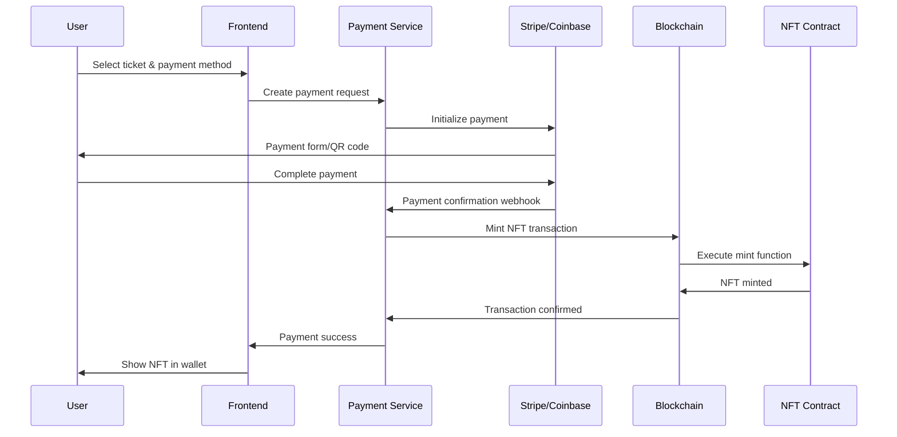

# Payment Integration Guide: Concert Ticket Tokenization Platform

## Overview

This document outlines the comprehensive payment integration strategy for the concert ticket tokenization platform, covering both fiat and cryptocurrency payment methods, payment processors, and implementation details.

## Payment Architecture

### 1. Multi-Channel Payment System

The platform supports multiple payment channels to maximize user accessibility:

- **Fiat Payments**: Credit cards, bank transfers, digital wallets
- **Cryptocurrency Payments**: Direct crypto payments, stablecoins
- **Hybrid Payments**: Fiat-to-crypto conversion with instant settlement
- **Cross-Chain Payments**: Support for multiple blockchain networks

### 2. Payment Flow Architecture

```
User Payment Request → Payment Gateway → Processor Selection → 
Transaction Processing → Blockchain Settlement → NFT Minting → 
Confirmation & Receipt
```

## Primary Payment Processors

### 1. Stripe (Primary Fiat Processor)

**Integration Details:**
- **API**: Stripe Payment Intents API
- **Supported Methods**: Credit cards, ACH, SEPA, digital wallets
- **Fees**: 2.9% + $0.30 per transaction
- **Settlement**: 2-7 business days
- **Webhooks**: Real-time payment status updates

**Implementation:**
```javascript
// Stripe Payment Intent creation
const paymentIntent = await stripe.paymentIntents.create({
  amount: ticketPrice * 100, // Convert to cents
  currency: 'usd',
  metadata: {
    ticketId: tokenId,
    eventId: eventId,
    userId: userId
  },
  automatic_payment_methods: {
    enabled: true,
  },
});
```

**Features:**
- 3D Secure authentication
- Fraud detection
- International payment support
- Recurring payment support
- Refund management

### 2. Coinbase Commerce (Crypto Payments)

**Integration Details:**
- **API**: Coinbase Commerce API
- **Supported Cryptocurrencies**: Bitcoin, Ethereum, USDC, DAI, LTC
- **Fees**: 1% per transaction
- **Settlement**: Near-instant
- **Webhooks**: Real-time payment confirmations

**Implementation:**
```javascript
// Coinbase Commerce charge creation
const charge = await coinbaseCommerce.charges.create({
  name: `Concert Ticket - ${eventName}`,
  description: `Ticket for ${eventName} at ${venue}`,
  local_price: {
    amount: ticketPrice,
    currency: 'USD'
  },
  pricing_type: 'fixed_price',
  metadata: {
    ticketId: tokenId,
    eventId: eventId
  }
});
```

**Features:**
- Multi-cryptocurrency support
- Automatic conversion to USDC
- Real-time price updates
- Secure wallet integration

### 3. MetaMask Integration (Direct Crypto)

**Integration Details:**
- **Method**: Web3.js + MetaMask
- **Supported Networks**: Ethereum, Polygon, BSC
- **Fees**: Network gas fees only
- **Settlement**: Instant (after confirmation)

**Implementation:**
```javascript
// Direct MetaMask payment
const transaction = await web3.eth.sendTransaction({
  from: userAddress,
  to: contractAddress,
  value: web3.utils.toWei(ticketPrice, 'ether'),
  data: contract.methods.buyTicket(tokenId).encodeABI()
});
```

### 4. Wyre (Fiat-to-Crypto On-Ramp)

**Integration Details:**
- **API**: Wyre API
- **Supported Methods**: ACH, wire transfer, debit cards
- **Fees**: 0.5% + $0.30 per transaction
- **Settlement**: 1-3 business days
- **Supported Cryptocurrencies**: USDC, USDT, ETH

**Implementation:**
```javascript
// Wyre transfer creation
const transfer = await wyre.transfers.create({
  source: 'card',
  dest: `ethereum:${userAddress}`,
  sourceCurrency: 'USD',
  destCurrency: 'USDC',
  amount: ticketPrice,
  referrerAccountId: WYRE_ACCOUNT_ID
});
```

## Payment Processing Workflow

### 1. Ticket Purchase Flow



### 2. Payment Verification Process

```javascript
// Payment verification service
class PaymentVerificationService {
  async verifyPayment(paymentId, amount, currency) {
    // Verify with payment processor
    const payment = await this.getPaymentDetails(paymentId);
    
    // Validate payment status
    if (payment.status !== 'succeeded') {
      throw new Error('Payment not completed');
    }
    
    // Validate amount
    if (payment.amount !== amount) {
      throw new Error('Payment amount mismatch');
    }
    
    // Validate currency
    if (payment.currency !== currency) {
      throw new Error('Payment currency mismatch');
    }
    
    return {
      verified: true,
      transactionId: payment.id,
      timestamp: payment.created
    };
  }
}
```

## API Integration Specifications

### 1. Payment Service API

```javascript
// Payment service endpoints
const paymentEndpoints = {
  // Create payment intent
  'POST /api/payments/create': {
    body: {
      ticketId: 'string',
      amount: 'number',
      currency: 'string',
      paymentMethod: 'stripe|coinbase|metamask|wyre',
      userAddress: 'string'
    },
    response: {
      paymentId: 'string',
      clientSecret: 'string',
      paymentUrl: 'string'
    }
  },
  
  // Verify payment
  'POST /api/payments/verify': {
    body: {
      paymentId: 'string',
      transactionHash: 'string'
    },
    response: {
      verified: 'boolean',
      nftTokenId: 'string'
    }
  },
  
  // Get payment status
  'GET /api/payments/:paymentId': {
    response: {
      status: 'pending|completed|failed',
      amount: 'number',
      currency: 'string',
      nftTokenId: 'string'
    }
  }
};
```

### 2. Webhook Handlers

```javascript
// Stripe webhook handler
app.post('/webhooks/stripe', express.raw({type: 'application/json'}), (req, res) => {
  const sig = req.headers['stripe-signature'];
  const event = stripe.webhooks.constructEvent(req.body, sig, STRIPE_WEBHOOK_SECRET);
  
  switch (event.type) {
    case 'payment_intent.succeeded':
      handlePaymentSuccess(event.data.object);
      break;
    case 'payment_intent.payment_failed':
      handlePaymentFailure(event.data.object);
      break;
  }
  
  res.json({received: true});
});

// Coinbase Commerce webhook handler
app.post('/webhooks/coinbase', (req, res) => {
  const event = req.body;
  
  if (event.type === 'charge:confirmed') {
    handleCryptoPaymentSuccess(event.data);
  }
  
  res.json({received: true});
});
```

## Security Implementation

### 1. Payment Security Measures

- **PCI DSS Compliance**: Secure handling of card data
- **Encryption**: End-to-end encryption for sensitive data
- **Tokenization**: Card tokenization for recurring payments
- **Fraud Detection**: Real-time fraud scoring
- **Rate Limiting**: API rate limiting to prevent abuse

### 2. Smart Contract Security

```solidity
// Payment escrow contract
contract PaymentEscrow {
    mapping(bytes32 => Payment) public payments;
    
    struct Payment {
        address buyer;
        address seller;
        uint256 amount;
        bool released;
        uint256 deadline;
    }
    
    modifier onlyAuthorized() {
        require(msg.sender == authorizedAddress, "Not authorized");
        _;
    }
    
    function releasePayment(bytes32 paymentId) external onlyAuthorized {
        Payment storage payment = payments[paymentId];
        require(!payment.released, "Payment already released");
        require(block.timestamp >= payment.deadline, "Payment not ready");
        
        payment.released = true;
        payable(payment.seller).transfer(payment.amount);
    }
}
```

## Fee Structure and Revenue Model

### 1. Platform Fees

| Payment Method | Platform Fee | Processor Fee | Total Fee |
|----------------|--------------|---------------|-----------|
| Stripe (Card) | 1.5% | 2.9% + $0.30 | 4.4% + $0.30 |
| Coinbase Commerce | 1.5% | 1.0% | 2.5% |
| MetaMask Direct | 1.5% | Gas only | 1.5% + Gas |
| Wyre On-Ramp | 1.5% | 0.5% + $0.30 | 2.0% + $0.30 |

### 2. Revenue Optimization

- **Volume Discounts**: Reduced fees for high-volume users
- **Loyalty Programs**: Fee reductions for platform tokens
- **Payment Method Incentives**: Lower fees for preferred methods
- **Cross-Chain Arbitrage**: Optimize fees across networks

## Implementation Timeline

### Phase 1: Core Payment Integration (Weeks 1-2)
- [ ] Stripe integration
- [ ] Basic payment verification
- [ ] Webhook handling
- [ ] Error handling and retry logic

### Phase 2: Crypto Payment Support (Weeks 3-4)
- [ ] Coinbase Commerce integration
- [ ] MetaMask direct payments
- [ ] Multi-currency support
- [ ] Price oracle integration

### Phase 3: Advanced Features (Weeks 5-6)
- [ ] Wyre fiat-to-crypto on-ramp
- [ ] Cross-chain payment support
- [ ] Payment analytics dashboard
- [ ] Advanced fraud detection

### Phase 4: Optimization (Weeks 7-8)
- [ ] Payment method optimization
- [ ] Fee optimization algorithms
- [ ] Performance monitoring
- [ ] Security audits

## Testing Strategy

### 1. Payment Testing

```javascript
// Payment integration tests
describe('Payment Integration', () => {
  test('Stripe payment success', async () => {
    const payment = await createStripePayment({
      amount: 10000, // $100.00
      currency: 'usd'
    });
    
    expect(payment.status).toBe('succeeded');
    expect(payment.amount).toBe(10000);
  });
  
  test('Coinbase Commerce payment success', async () => {
    const charge = await createCoinbaseCharge({
      amount: '100.00',
      currency: 'USD'
    });
    
    expect(charge.status).toBe('NEW');
  });
});
```

### 2. End-to-End Testing

- **Payment Flow Testing**: Complete user journey testing
- **Error Handling**: Network failures, payment failures
- **Load Testing**: High-volume payment processing
- **Security Testing**: Penetration testing, vulnerability scanning

## Monitoring and Analytics

### 1. Payment Metrics

- **Success Rate**: Payment completion percentage
- **Average Processing Time**: Time from initiation to completion
- **Fee Analysis**: Cost breakdown by payment method
- **User Behavior**: Payment method preferences

### 2. Real-time Monitoring

```javascript
// Payment monitoring dashboard
const paymentMetrics = {
  totalVolume: 0,
  successRate: 0,
  averageProcessingTime: 0,
  topPaymentMethods: [],
  errorRate: 0
};

// Real-time updates
setInterval(async () => {
  const metrics = await calculatePaymentMetrics();
  updateDashboard(metrics);
}, 30000); // Update every 30 seconds
```

## Compliance and Regulations

### 1. Financial Regulations

- **KYC/AML**: Know Your Customer and Anti-Money Laundering
- **PCI DSS**: Payment Card Industry Data Security Standard
- **GDPR**: General Data Protection Regulation
- **CFTC**: Commodity Futures Trading Commission (for crypto)

### 2. Tax Reporting

- **1099-K Forms**: Annual reporting for merchants
- **Crypto Tax Reporting**: Digital asset transaction reporting
- **International Compliance**: Cross-border payment regulations

## Future Enhancements

### 1. Advanced Payment Features

- **Buy Now, Pay Later**: Integration with BNPL providers
- **Subscription Payments**: Recurring payment support
- **Multi-Signature Wallets**: Enhanced security for large transactions
- **Payment Splitting**: Split payments among multiple parties

### 2. Cross-Chain Integration

- **Layer 2 Solutions**: Optimism, Arbitrum integration
- **Bridge Protocols**: Cross-chain asset transfers
- **Interoperability**: Universal payment standards
- **Scalability**: High-throughput payment processing

This comprehensive payment integration strategy ensures the concert ticket tokenization platform can handle diverse payment methods while maintaining security, compliance, and user experience standards.
